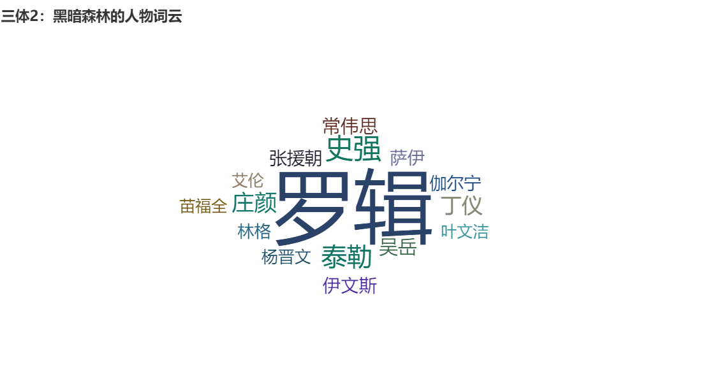
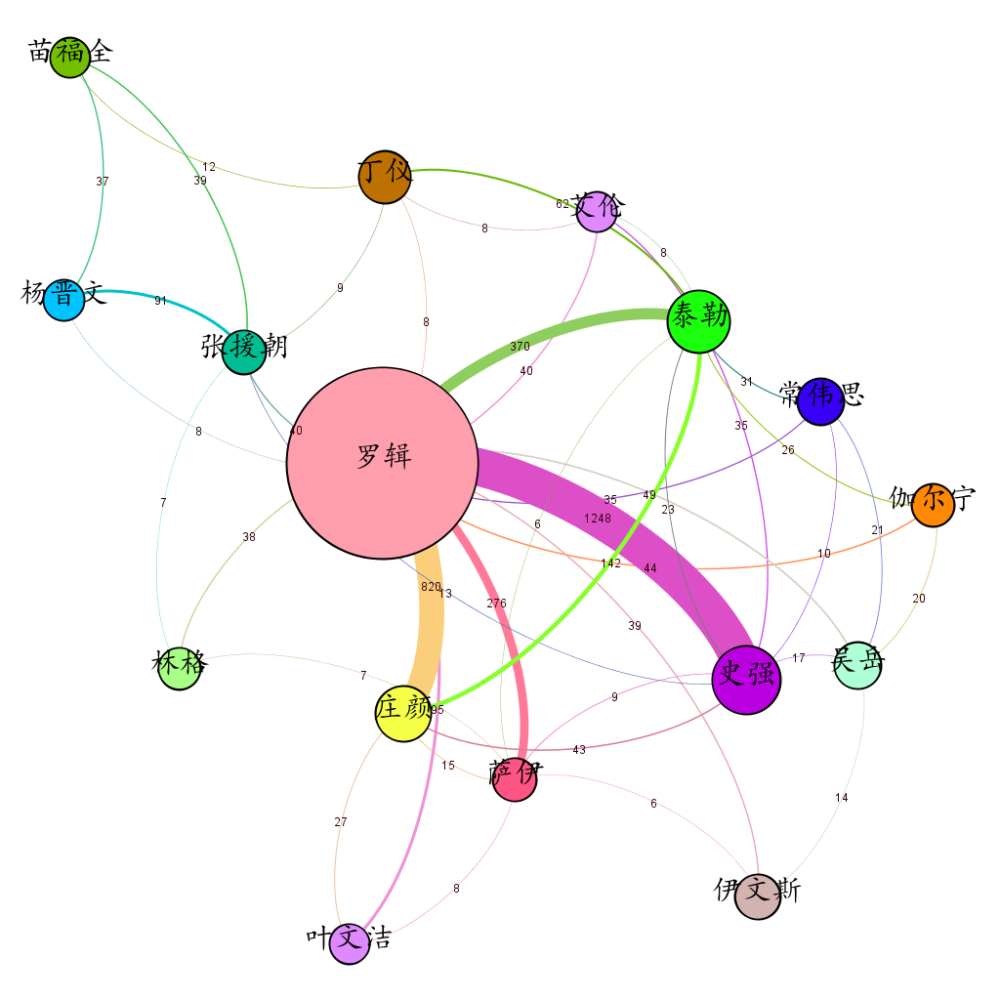

项目介绍
=================

**项目名称：** 文本人物关系分析

**项目简介：** 

+ 抽取《三体2：黑暗森林》中的人物名称
+ 分析人物与人物之间关系的紧密程序，紧密程度为人物和人物在每1000词里共存的次数。

**项目说明：**

- 实现方法参考：https://www.shiyanlou.com/courses/677/learning/?id=2202

- 原思路：直接运行代码，得到人物出场次数和人物关系txt，进行可视化。

  - 问题：

    1. 中文人物称谓复杂：中文中对于亲近的人可能只含其名不喊其姓，又或是有独特的称呼方式。
    2. 结果太多：一部分是jieba分词得到的结果不够精确，另一部分存在很多无足轻重的人物。

  - 解决方法：

    - 在豆瓣上找到了人物介绍，https://book.douban.com/review/10164790/，做成name.txt。对于不在name中的名字，不视作人物。

    - 对于出现次数<=10和人物关系<=5的情况，直接忽略。默认属于打酱油角色。

      

+ **代码内容**

| 函数 | 位置 | 功能 |
|:-------:    |:-------:|:-------:    |
| main | main.py | 1.找到文件路径，调用book_analysis.py 2.生成两个txt文件，分别是人物出场次数及人物关系 3. 生成词云 |
| READFILE | book_analysis.py | 读取文件内容 |
| Content_analysis | book_analysis.py | 处理文章（文件内有详细注释） |
| Relation_analysis | book_analysis.py | 处理文章（文件内有详细注释） |

- 输出形式：使用**<u>txt文件及可视化的形式</u>**进行输出。

  - 使用了pyechart制作词云。效果如下

  - 使用了Gephi进行可视化，跟着网上教程进行制作。将两个txt文件内容导入之后，再进行外观设置。
  
    - 节点大小表示人物出现次数的多少，边的粗细代表人物间联系紧密程度。效果如下
    
    
    
    

